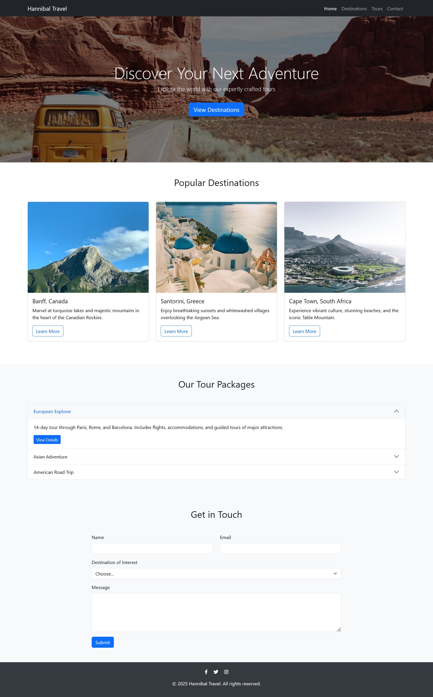

# Hannibal Travel - Landing Page

Welcome to the **Hannibal Travel** landing page! This responsive website showcases popular travel destinations and tour packages, and includes a contact form for inquiries.

## Features

- **Modern, responsive design** using Bootstrap 5
- **Navigation bar** with smooth scrolling to sections
- **Hero section** with a call-to-action
- **Popular Destinations** cards with images and descriptions
- **Accordion-style Tour Packages** with details and "View Details" buttons
- **Contact form** for user inquiries
- **Footer** with social media links

## Live Preview

[View Live Site](https://django-unchained-01.github.io/Travel_Agency_Landing_Page/)

## Screenshot



## Getting Started

1. **Clone the repository:**
   ```bash
   git clone https://github.com/django-unchained-01/Travel_Agency_Landing_Page
   ```
2. **Open `index.html` in your browser** to view the site locally.

## Technologies Used

- HTML5
- CSS3 (with Bootstrap 5)
- Font Awesome (for icons)

## Customization

- Update images and text in `index.html` to match your agency's offerings.
- Modify styles in `style.css` for branding.

## License

This project is open source and available under the [MIT License](LICENSE).